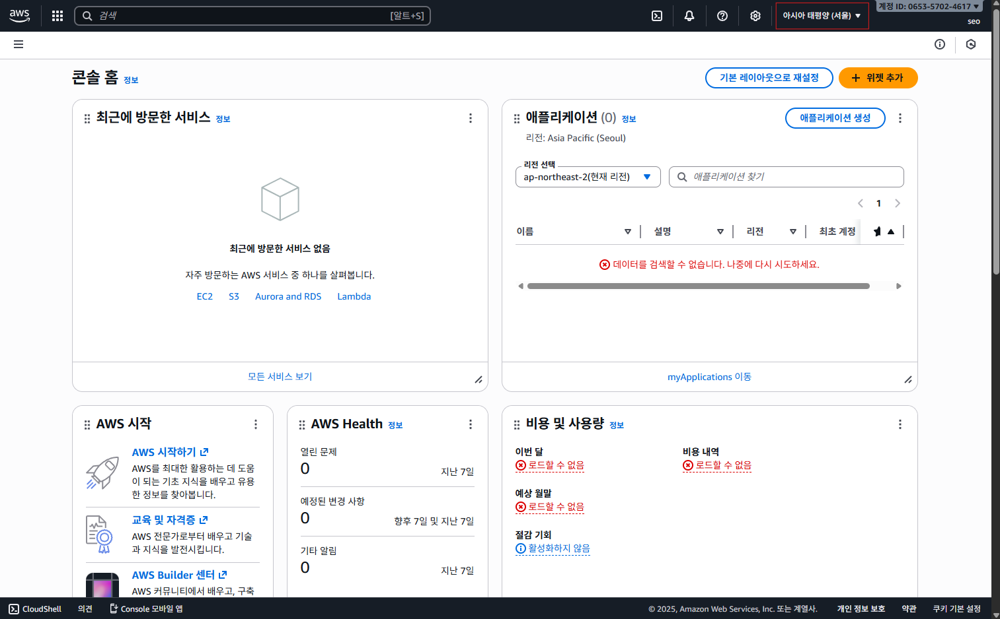

# AWS free tier(무료 플랜) 가입
# 해당 수업 중 사용하는 개념
1. EC2
  - 원격으로 접속해서 사용할 수 있는 컴퓨터를 빌려주는 서비스(즉, 내부에 OS가 있고, 거기서 springboot 프로젝트를 실행시키면 원격 접속이 된다는 의미)
2. Route 53
  - 도메인 주소를 발급하고 관리하는 서비스(사실 무료로 찾으면 뭐가 많습니다.)
3. ELB(Elastic Load Balancing)
  - 웹 사이트로 보내는 요청을 연결된 서버로 적절히 나누는 서비스
  - 근데 저희가 작성하는 서비스가 그정도로 인기가 있는 것은 아니라서 뭘 할거냐면 HTTPS 설정을 위해서 사용.
4. RDS
  - 관계형 데이터베이스를 빌려주는 서비스. EC2 내에 DB를 집어넣어서 바로 배포를 해도 되지만 이 경우 EC2가 멈췄을 때 엄한 DB가 다 날아가기 때문에 서버를 분산해둡니다. RDS에서는 DB 관련 제공하는 부가 서비스가 많아서 분리해두는 편입니다.
5. S3
  - 파일을 안전하고 효율적으로 저장할 수 있는 `스토리지를 빌려주는` 서비스. 일상 생활에서 아이클라우드나 구글 드라이브에 사진 및 문서 / 영상을 올리는 것처럼 파일 자체를 저장할 수 있는 공간이 필요한데, S3를 활용하면 해당 파일을 `객체 단위`로 쉽게 저장하고 내려받을 수 있습니다.
6. CloudFront
  - 파일이나 영상 등의 컨텐츠를 빠르게 전송하도록 돕는 서비스.
  - 저희는 Frontend의 정적 웹페이지를 배포하는 용도로 사용.


아마존 콘솔 로그인



우측 상단 → 지역 : 아시아 태평양 서울 설정

EC2 검색하여 EC2 Dashboard 이동

# EC2로 백엔드 서버 배포하기
1. 배포(Deployment)란 무엇인가?
  - 다른 사용자들이 인터넷을 통해서 사용할 웹 서비스를 사용할 수 있도록 만드는 것을 의미함.
  
  .png>)

  - 자신의 컴퓨터로 개발할 때에는 localhost라는 주소로 테스트도 하고 개발도 했느데, 이는 다른 컴퓨터에서는 접근이 불가능한 주소에 해당합니다. 배포 과정을 수행하게 되면 IP(ex : 1234.16.2.1)나 도메인 주소(ex : www.naver.com)과 같이 고유한 방식으로 주소를 부여 받아, 다른 컴퓨터에서 이 주소로 접속할 수 있게끔 하는 것을 `배포` 라고 합니다.
  - 어떤 서비스를 완성했다면, 그 다음 단계로 해야하는 것이 배포에 해당하겠네요.

## EC2
  - Elastic Compute Cloud의 축약어로 보통 이러면 ECC로 할 것 같은데 AWS에서는 이니셜이 겹치면 숫자로 퉁쳐버리는 방식으로 네이밍을 합니다.
  - 컴퓨터를 빌려서 원격으로 접속해 사용하는 서비스.
  - 컴퓨터 하나.

### EC2의 학습 이유
  - 백엔드 서버를 배포하기 위해서는 컴퓨터가 필요합니다.
  (그래서 서버용 컴퓨터를 24/7 켜두는 경우도 있습니다.) 내가 가진 컴퓨터에서 서버를 배포해 다른 사용자들이 인터넷을 통해 접근할 수 있게 만드는 것이 가능한데, 그러면 내 컴퓨터가 인터넷에 퍼져있는 것이기 때문에 보안적으로는 불안할 수 있겠네요.

  - 그래서 AWS의 EC2라는 컴퓨터를 빌려서 보안적으로도 안전하고, 여러 부가 기능(로깅, 오토스케일링, 로드 밸런싱)을 이용하는 것이 보편적입니다.

  - 현업에서도 실제 서버 배포할 때 EC2 많이 씁니다.

## 리전(Region)
  - 인프라를 지리적으로 나누어 배포한 각가의 데이터 센터.
  - EC2는 컴퓨터를 빌려서 원격으로 접속할 수 있게끔 하는데, 여러분이 대한민국 부산에 살면서 미국 버지니아 동부에 있는 컴퓨터 빌려서 회원가입할 때 요청 보낼 때 마다 미 동부까지 찍고 응답이 온다고 생각하시면 됩니다.

  - 이상을 이유로 애플리케이션의 주된 사용자들의 위치와 지리적으로 가까운 리전을 선택하는 것이 유용합니다.

  - default 값이 미 버지니아 북부로 잡혀있어서 EC2 업삳고 다시 만들면 요금 폭탄 먹습니다. 꼭 꼭 꼭 꼭 꼭!!! 서울로 맞출 것.

  - EC2는 리전마다 `따로 관리` 되고 있습니다.

## EC2 기본 설정
1. 이름 및 태그 : instagram-server(예시)
2. 애플리케이션 및 OS 이미지(Amazon Machine Image)
  - Ununtu 선택
  - OS를 선택하는 단계인데, Windows나 MAcOS는 용량도 많이 차지하고 성능도 많이 잡아먹기 때문에 돈이 너무 많이 나갑니다. 우리가 하나하나 커스텀 할 수 있는 가벼운 OS Ubuntu를 이용하여 배포를 하는 편입니다.
3. AMI : default 값(프리티어 사용가능)
4. 인스턴스 유형
  - t3.micro 선택할건데, 유형의 의미는 굳이 말하자면 컴퓨터 사양에 해당한다고 볼 수 있습니다.
  - micro `<` small ... 순으로 이루어지는데, 사양이 좋을 수록 많은 수의 요청을 처리할 수 있고, 무거운 서버나 프로그램을 운영할 수 있겠죠.
  - t2.micro에서 2,000명 정도의 서비스를 운영해도 별 문제 없었기 때문에 굳이 돈내고 유형을 올릴 필요는 없습니다.
5. 키 페어(로그인) : EC2 컴퓨터에 접근할 때 사용하는 비밀번호.
  - 키 페어 이름 : 새 키페어 생성 → `instagram-server-key-pair`
  - 키 페어 유형 : RSA / ED25519 둘 다 상관 없음.

  - 키 페어 이름은 어떤 EC2에 접근하기 위한 키 페어였는지 앞아볼 수 있도록 지정하는게 좋습니다.
  - 키 페어 생성을 하면 파일이 하나 다운 받아지기는 하는데, 보통은 잃어버리면 안됩니다. 저희는 뭐 계속 지웠다가 깔았다가 할 거니까 큰 문제는 없습니다.
  - 저희 실습에서는 키 페어 말고 다른 편한 방식을 이용할 예정


6. 네트워크 설정
  - 편집 선택
  - VPC (default 기본값 설정)
  - 보안 그룹 이름 : instagram-server-security-group
  - 보안 그룹 설명 : instagram-server-security-group
  - 인바운드 보안 그룹 공식 : default 22 번 값 남겨두기(중요함)
      - (추가)
      ```
      - 유형 : HTTP
      - 소스 유형 : 위치 무관
      - 원본 : 
      - 설명(선택사항) : 
      ```
7. 스토리지 구성
30 GB gp3

8. 인스턴스 시작

9. 인스턴스 → 인스턴스 상태 `실행 중` / 중지 / 재부팅 / 종료 가 있음.

10. 인스턴스 ID → 여러가지 인스턴스 정보
  - 퍼블릭 IPv4 주소

  - 보안 클릭 → 인바운드 규칙 : default 포트범위 22 / 80 번 인지 확인 필요
  - storage : 30 인지 확인 필요

  - 맨 위 연결 클릭 → Ubuntu 체크 → 연결 클릭 → CLI 나오는지 확인

11. 탄력적 IP 주소
  - 탄력적 IP 주소 할당 → 할당 → 할당된 IPv4 주소 클릭 → 탄력적 IP 주소 연결
  - 인스턴스 선택 : instagram server → 연결

## EC2 보안 그룹(Security Group) 설정
  - 네트워크 설정 → 보안 그룹 이름 부분에 좀 집중하겠습니다.
  - Security Group 이란?
    - 이하의 이미지를 참조하여, EC2 인스턴스가 집이라고 생각한다면, 보안 그룹은 집 바깥쪽에 있는 `방화벽(firewall)` 역할이라고 생각할 수 있습니다. 집에 접근할 때 방화벽 앞에서 접근해도 되는 요청인지 검사하는 것으로 생각해볼 수 있겠습니다.

    

    - 인터넷에서 입루 사용자가 EC2 인스턴스에 접근(Access) 하려고 할 때, 보안 그룹을 만들고 보안 그룹에 `규칙`을 지정합니다. 이 규칙에는 _인바운드 트래픽(즉, 외부에서 EC2 인스턴스로 보내는 트래픽)_ 에서 어떤 트래픽만 허용할 지 설정할 수 있고, _아웃바운드 트래픽(즉, EC2 인스턴스에서 외부로 나가는 트래픽)_ 에서 어떤 트래픽만 허용할 지 설정 가능.

    - 보안 그룹 설정 시에 허용할 IP 범위와 포트(port)를 설정 가능.

    - 보안그룹 설정
      - 외부에서 EC2로 접근할 포트는 default인 22 번 포트와 80 번 포트라고 가정하겠습니다.(backend 배포할 때 8080이었던 점을 생각하시면 됩니다.) 80 번 포트에서 백엔드 서버를 띄울 예정입니다.

    - IP vs. Port
      - IP : 네트워크 상에서 _특정 컴퓨터를 가리키는 주소_
      - Port : 한 컴퓨터 내에서 _실행되고 있는 특정 프로그램의 주소_

      - 그러면 특정 서버와 통신하기 위해서는 ip주소 및 port 번호를 다 알아야 할 것 같은데 우리는 _주소_ 를 이용하여 웹 서비스를 사용합니다. 이는 → domain 개념과 연결되겠네요.

      - 그러면 ip는 domain과 연결한다고 가정했을 때, port 번호는 모르는데 어떻게 정상적으로 통신이 가능한가?
      
      - 주소창에 도메인을 입력하고 Enter치면 브라우저에서 기본적으로 80 번 포트로 보내도록 설정돼있습니다.
      - 그래서 만약에 80번 포트로 보내는 것이 싫다면 `http://www.naver.com:3000` 과 같은 식으로 지정하는 것도 가능합니다.

    - 잘 알려진 포트(Well-Known Port)란?
      - @ -65,535 번까지 포트 번호를 사용 가능함.
      - 그 중에서 0 ~ 1023 번까지의 포트는 주요 통신을 위한 규약에 따라 이미 정해져 있씁니다.
      - 규약을 통해 역할이 정해져 있는 포트 번호를 `잘 알려진 포트`라고 합니다.

      - 예시
        - 22(SSH, Secure Shell Protocal) : 원격 접속을 위한 포트
          - EC2 인스턴스에 연결할 때 22 번 포트 사용.
        - 80(HTTP) : HTTP로 통신할 때 사용.
        - 443(HTTPS) : HTTPS로 통신할 때 사용.
      
      * 근데 이 규약이 꼭 지켜져야하냐고 물으면 그건 아닙니다. 다르게 사용해도 되니까 80 번 포트에 3000 이나 8080 을 쓰셔도 무방합니다.

# EC2 스토리지 설정
  - EC2가 하나의 컴퓨터다 보니까 여러 파일으 ㄹ저장할 저장 공간이 필요합니다. 해당 공간을 EBS(Elastic Block Storage)라고 부릅니다. 그냥 EC2내의 하드디스크라고 생각하셔도 무방하겠습니다. EBS보다 더 포괄적인 용어로 Storage, Volume이라는 표현을 쓰기도 합니다.

  - 30GB까지 공짜라서 그렇게 설정해두도록 하겠습니다.

## 탄력적 IP 연결하기(Elastic IP)
  - 단력적 IP의 필요성 : EC2 인스턴스를 생성하면 IP를 할당 받습니다. 근데 얘가 임시적인 겁니다. EC2를 잠깐 중지시켰다가 다시 실행시키면 IP가 바뀌어있게 됩니다. 그래서 중지시켰다가 다시 실행해도 바뀌지 않는 고정 IP를 할당받아야 하는데, 이를 `탄력적 IP` 라고 합니다.

  - EC2 콘솔 내부에서 좌측의 사이드 바를 밑으로 내렸을 때, `네트워크 및 보안` 탭 내에 `탄력적 IP`가 있습니다.

  - `탄력적 IP 할당` 버튼을 눌러서 할당 받으면, `기준 인스턴스와 연결` 하는 과정이 필수족으로 요구됩니다.

  - 할당된 IP주소를 클릭한 다음, `탄력적 IP 연결` 버튼 클릭, 저희 기준으로는 instagram-server 인스턴스와 연결해줍니다.

  - 그러면 instagram-server의 ip 주소가 아니라 탄력적 ip를 통해서 접근하는 것이 가능해집니다.

## SpringBoot 프로젝트를 EC2에 배포하기
1. 저희는 EC2가 컴퓨터라고 했죠. 그러면 컴퓨터에 새 프로젝트를 설치할 필요가 있겠습니다. 그러면 새 컴퓨터에 우리는 JDK를 설치해야 합니다.
```
sudo apt update && 
```
EC2의 CLI에서 붙여넣기를 하고싶다면 : shift + ins

```
sudo apt install openjdk-17-jdk -y
```

2. jdk 설치가 끝났다면 설치가 완료됐는지 확인하는 명령어

```
java -version
```

3. springBoot 에서 프로젝트를 EC2에 clone 하기 

```
git clone https://github.com/maybeags/aws_practice.git
```

4. 설치됐는지 확인하기 위한 명령어 : ls

5. 내부 폴더로 들어가기 위한 명령어 : cd 폴더명

```
cd aws_practice
```

```
cd ec2-spring-boot-sample
```

6. 실행 권한 부여하기
```
chmod +x ./gradlew
```

7. EC2 내부에서 server를 실행시키기

```
./gradlew clean build
```
이상의 명령어 의미 : 기존 빌드된 파일을 삭제하고 새로 빌드

8. 6, 7 번 명령어를 실행시키고, Build Successful 이 된다면, ls 명령어를 입력했을 떄, build라고 하는 폴더가 새로 생성되어 있습니다.
  - 기존 : 
    build.gradle  gradle  gradlew  gradlew.bat  settings.gradle  src

  - Build 후(6, 7 명령어 후 ls) : 
    build  build.gradle  gradle  gradlew  gradlew.bat settings.gradle  src

9. build 된 파일을 실행시키기 위해 폴더 이동
```
cd build/libs
```

10. jar 파일 생성
```
sudo java -jar ec2-spring-boot-sample-0.0.1-SNAPSHOT.jar
```

http://탄력적ip붙여넣기

Whitelaber Error Page → 배포 완료

## EC2 종료하기
1. EC2 대시보드 들어가서 instagram-server 클릭 → 우상단 `인스턴스 상태` 클릭 → `인스턴스 종료(삭제)` 클릭

2. 그러면 우리는 빌린 컴퓨터는 반납했습니다. 근데 하나가 남았어요. → 탄력적 IP

3. 탄력적 IP 클릭 → 우상단 `작업` 클릭 → 탄력적 IP 연결 해제 → `탄력적 IP 릴리즈` 클릭

  (인스턴스 삭제 / 탄력적 IP 릴리즈 후)

4. EC2 대시보드 → 키페어 → 작업 → 삭제  \
   EC2 대시보드 → 보안그룹 → instagram-server-group → 삭제
